# Технічне Завдання: Веб-модуль «Лабораторна інформаційна система» (MedLink ЛІС 3.0)

**Замовник:** ТОВ «МедЛінк» (MedLink LLC) © 2026.  
**Продукт:** Веб-МІС MedLink (evomis) та автономний SaaS/On-Premise ЛІС-продукт.  
**Ревізія документа:** 3.0 (Майстер-Специфікація: 100% відповідність `ТЗ_ЛІС_переосмислене_v2.docx` + вичерпний інженерний стек MedLink).  
**Інтерактивний прототип:** [http://localhost:8088/medlink_lab_frontend/run_prototype.html](http://localhost:8088/medlink_lab_frontend/run_prototype.html)  
**HTML версія специфікації:** [http://localhost:8088/TZ_LIS_MedLink_v3_Master_Specification.html](http://localhost:8088/TZ_LIS_MedLink_v3_Master_Specification.html)

---

## Зміст документа
1. [Мета та контекст документа](#1-мета-та-контекст-документа)
2. [Шкала пріоритетів (MoSCoW)](#2-шкала-пріоритетів-moscow)
3. [Конкурентні переваги та порівняння з ринком](#3-конкурентні-переваги-та-порівняння-з-ринком)
4. [Ролі користувачів та сценарії](#4-ролі-користувачів-та-сценарії)
5. [Зведений реєстр 44 модулів системи](#5-зведений-реєстр-44-модулів-системи)
6. [Розподіл функціоналу за категоріями](#6-розподіл-функціоналу-за-категоріями)
7. [Функціональні вимоги до модулів](#7-функціональні-вимоги-до-модулів)
   - 7.1. [Ядро ЛІС (CORE-01..15)](#71-ядро-ліс-core-0115)
   - 7.2. [Контроль якості (QC-01..09)](#72-контроль-якості-qc-0109)
   - 7.3. [Кабінет пацієнта (PT-01..17)](#73-кабінет-пацієнта-pt-0117)
   - 7.4. [Зовнішні інтеграції (INT-01..04)](#74-зовнішні-інтеграції-int-0104)
   - 7.5. [Розширена клінічна частина (EXT-01..05)](#75-розширена-клінічна-частина-ext-0105)
   - 7.6. [Комерційний та складський блок (COM-01..04)](#76-комерційний-та-складський-блок-com-0104)
   - 7.7. [Аналітика та конструктори (AN-01..04)](#77-аналітика-та-конструктори-an-0104)
8. [Структура інтерфейсу та UX-принципи](#8-структура-інтерфейсу-та-ux-принципи)
9. [Нефункціональні вимоги (NFR)](#9-нефункціональні-вимоги-nfr)
10. [Вирішення 10 відкритих питань продукту (OQ-01..10)](#10-вирішення-10-відкритих-питань-продукту-oq-0110)
11. [15 Живих скріншотів та наскрізні сценарії](#11-15-живих-скріншотів-та-наскрізні-сценарії)
12. [Багатовимірна матриця референтів Delphi (Довідник послуг)](#12-багатовимірна-матриця-референтів-delphi-довідник-послуг)
13. [Специфікація REST API (MedLink Laboratory Gateway)](#13-специфікація-rest-api-medlink-laboratory-gateway)
14. [DDL файли та схема бази даних (PostgreSQL / SQLite)](#14-ddl-файли-та-схема-бази-даних-postgresql--sqlite)
15. [Апаратний шлюз .NET 8 (MedLink.LabConnector)](#15-апаратний-шлюз-net-8-medlinklabconnector)
16. [Реєстр файлів проєкту та навігація](#16-реєстр-файлів-проєкту-та-навігація)

---

## 1. Мета та контекст документа

Цей документ є переосмисленою та структурованою версією технічного завдання на модуль «Лабораторна інформаційна система» (ЛІС), що консолідує три джерела, накопичені в процесі аналізу ринку:
- початкове функціональне ТЗ вікна лаборанта «Дослідження» та картки «Довідник послуг» веб-МІС;
- порівняльний gap-аналіз функціоналу з промисловими LIS-рішеннями STARLIS (фокус: контроль якості, автоверифікація, delta-check, reflex-тестування) та LISmart компанії NeoTechLab (фокус: мікробіологія, апаратні інтеграції, фінансовий та складський облік, HL7);
- огляд демонстраційних матеріалів (відео та скріншоти) ЛІС початкового рівня, що ілюструє мінімально необхідний набір сценаріїв роботи лабораторії.

### 1.1. Ключові принципи переосмислення
1. **Пріоритет — малі та середні лабораторії.** MVP закриває 100% потреб лабораторії з 1–5 робочими місцями без надлишкової складності великих систем.
2. **Веб-first, без десктопної версії.** Виключно веб-застосунок (SaaS/cloud) на базі дизайн-системи MedLink evomis.
3. **Кабінет пацієнта як точка диференціації.** Повний комплекс 17 функцій (PT-01..17).
4. **Максимальне охоплення модулів.** Зведений реєстр із 44 модулів за шкалою MoSCoW.
5. **Українська специфіка ринку.** ДСТУ EN ISO 15189:2022, інтеграція з eHealth/ЕСОЗ, підтримка КЕП, лабораторні протоколи ASTM та HL7.

---

## 2. Шкала пріоритетів (MoSCoW)

| Позначення | Значення | Трактування для релізного планування |
| --- | --- | --- |
| Must | Обов'язково | Без цього MVP не має клінічної та комерційної цінності — блокує запуск |
| Should | Бажано | Суттєво підвищує конкурентоспроможність; переноситься в реліз 2, якщо тисне дедлайн MVP |
| Could | Можливо | Диференціююча або нішева функція; розглядається після валідації MVP на пілотних лабораторіях |
| Won't (MVP) | Не зараз | Свідомо виключено з горизонту 12 міс.; фіксується як відкрите питання на майбутнє |


---

## 3. Конкурентні переваги та порівняння з ринком

| Перевага | Джерело порівняння | Чому важливо для малих/середніх лабораторій |
| --- | --- | --- |
| Автоверифікація та delta-check «з коробки» | STARLIS (gap-аналіз) | Скорочує навантаження лікаря-лаборанта там, де немає ресурсу на 100% ручну перевірку |
| Готовий кабінет пацієнта з графіками трендів | Відсутнє у всіх 3 джерелах — нова розробка | Знижує дзвінки/звернення в реєстратуру, конкурентна перевага проти LIS без пацієнтського порталу |
| Наскрізна інтеграція з ЕСОЗ у складі МІС | Базове ТЗ (розд. 6.3) | Знімає потребу в окремій інтеграції для клієнтів МІС — ключова причина обрати вбудований модуль |
| Веб-first, мультиплатформність без desktop-версії | Переосмислення (відхід від початкового ТЗ ЛІС) | Нижча вартість впровадження й підтримки, доступ з будь-якого пристрою, швидші оновлення |
| Прозорий модульний реєстр з пріоритетами | Цей документ, розд. 5 | Дозволяє малій лабораторії підключати лише потрібні модулі й платити за фактичне використання |


---

## 4. Ролі користувачів та сценарії

| Роль | Типовий сценарій використання | Ключові модулі |
| --- | --- | --- |
| Лаборант | Прийом матеріалу, введення результатів, друк направлень і бланків, штрихкодування | Реєстрація направлень, Маркування, Введення результатів, Друк |
| Лікар-лаборант / завідувач лабораторії | Верифікація результатів, контроль критичних значень, керування QC | Верифікація, QC, Дашборд статистики |
| Адміністратор системи | Керування довідниками, ролями, обладнанням, налаштуваннями лабораторії | Адміністрування, Довідники, Налаштування |
| Реєстратор / старша медсестра | Перегляд черги, підтвердження прийому матеріалу, попередній запис | Черга направлень, Онлайн-запис |
| Пацієнт | Перегляд власних результатів, динаміки показників, запис на аналізи, оплата | Кабінет пацієнта |
| Лікар-замовник (у складі МІС) | Направлення на дослідження, перегляд результату в ЕМК пацієнта | Інтеграція з МІС/ЕМК |


---

## 5. Зведений реєстр 44 модулів системи

Нижче наведено повний зведений реєстр модулів із таблиці 3 оригінального ТЗ:

| № | Модуль | Категорія | Ключові можливості | Пріоритет | Реліз |
| --- | --- | --- | --- | --- | --- |
| 1 | Автентифікація та керування обліковими записами | Ядро | Самореєстрація лабораторії, активація через e-mail, відновлення пароля, захист від перебору | Must | R1 |
| 2 | Адміністрування, ролі та RBAC | Ядро | Довільні групи користувачів, права на підрозділи/таблиці/функції/звіти, журнал аудиту | Must | R1 |
| 3 | Довідники та лабораторна номенклатура | Ядро | Показники, групи показників, одиниці виміру, набори/профілі тестів, типи біоматеріалу, підрозділи | Must | R1 |
| 4 | Довідник послуг (карта послуги) | Ядро | Вкладки Головна/Показники/Норми/Лабораторія, демографічні референтні норми | Must | R1 |
| 5 | Реєстрація направлень (замовлень) | Ядро | Прив'язка до пацієнта/лікаря, пакетна реєстрація, автонумерація, статуси | Must | R1 |
| 6 | Штрихкодове маркування біоматеріалу | Ядро | Друк етикеток, підтримка Code128/EAN-13/Code39, прив'язка до направлення | Must | R1 |
| 7 | Постановки / робочі листи (батчі) | Ядро | Формування робочих списків за обладнанням/виконавцем, масові дії | Should | R1–R2 |
| 8 | Інтеграція з аналізаторами — ASTM | Ядро | Двосторонній обмін результатами та QC-даними, моніторинг з'єднання | Must | R1 |
| 9 | Інтеграція з аналізаторами — HL7 v2.x | Ядро | Альтернативний протокол поряд з ASTM, вибір на рівні приладу | Must* | R2 |
| 10 | Введення та обробка результатів | Ядро | Вікно «Дослідження»: черга, inline-редагування, автоматична критичність | Must | R1 |
| 11 | Верифікація результатів (роль лікар-лаборант) | Ядро | Обов'язкове підтвердження перед видачею, коментар при критичному значенні | Must | R1 |
| 12 | Друк бланків результатів / направлень / штрихкодів | Ядро | PDF-генерація, QR-верифікація, дизайнер бланків | Must | R1 |
| 13 | Розсилка результатів (e-mail) | Ядро | Відправка бланку на e-mail, журнал доставки | Should | R1–R2 |
| 14 | Базова звітність і статистика | Ядро | Кількість направлень/тестів за період, підрозділом, виконавцем; експорт Excel/PDF/CSV | Should | R1 |
| 15 | Відомості про лабораторію та загальні налаштування | Ядро | Реквізити, нумератори, значення за замовчуванням, кольорові маркери | Must | R1 |
| 16 | Автоверифікація результатів | Якість результатів | Rule-engine: автозатвердження в межах норми без прапорців і критичних відхилень | Must | R1–R2 |
| 17 | Delta-check | Якість результатів | Порівняння з попереднім результатом пацієнта, налаштовуваний поріг і вікно (72 год) | Must | R1–R2 |
| 18 | Reflex-правила (автопризначення) | Якість результатів | Автододавання показника/послуги за умовою без повторного направлення лікаря | Should | R2 |
| 19 | Автоматична маршрутизація критичних результатів | Якість результатів | Окреме сповіщення лікаря (push/SMS) незалежно від друку бланку, з підтвердженням отримання | Must | R1 |
| 20 | Внутрішній контроль якості QC (Levey-Jennings, Westgard) | Якість результатів | Контрольні картки, правила 1-2s/1-3s/2-2s/R4s/4-1s/10x, блокування видачі при порушенні | Must | R2 |
| 21 | Зовнішня оцінка якості (ФСВЯ/EQA) | Якість результатів | Облік раундів міжлабораторного порівняння, звітність для акредитації | Should | R2–R3 |
| 22 | Розширена QC-статистика (TEA, повторюваність, коректність) | Якість результатів | CVn/Δ%/Δ%N, контроль дублікату, звіти з матеріалу/TEA/тренду | Should | R3 |
| 23 | Демографічні референтні норми | Якість результатів | Фільтри стать/вік/вагітність/методика на рівні кожної норми | Must | R1 |
| 24 | Кабінет пацієнта — результати та статуси | Кабінет пацієнта | Перегляд/завантаження результатів, статус виконання, PDF-бланк, історія досліджень | Must | R1 |
| 25 | Кабінет пацієнта — графіки трендів показників | Кабінет пацієнта | Візуалізація динаміки значення в часі з межами норми | Should | R2 |
| 26 | Кабінет пацієнта — онлайн-запис та оплата | Кабінет пацієнта | Попередній запис на забір матеріалу, онлайн-оплата платних послуг | Should | R2 |
| 27 | Кабінет пацієнта — сімейний профіль та QR-верифікація | Кабінет пацієнта | Керування результатами дітей/родичів, QR для верифікації третьою стороною | Could | R3 |
| 28 | Інтеграція з eHealth / ЕСОЗ | Інтеграції | Service Request → DiagnosticReport, підпис КЕП, черга повторних відправок | Must* | R1 |
| 29 | Інтеграція з МІС (ЕМК, картка пацієнта) | Інтеграції | Наскрізна робота для вбудованого сценарію, спільна автентифікація | Must | R1 |
| 30 | Пакетний імпорт результатів файлом (CSV/XML) | Інтеграції | Завантаження результатів кількох досліджень з попереднім переглядом | Could | R2 |
| 31 | Offline-буфер | Інтеграції | Локальне збереження введених даних при втраті з'єднання, авто-синхронізація | Could | R3 |
| 32 | Мікробіологічний блок | Розширена клінічна | Реєстрація посіву, ідентифікація збудника, антибіотикограма S/I/R | Should | R2–R3 |
| 33 | Пряма інтеграція з мікроскопами/сканерами зображень | Розширена клінічна | Автоматичне прикріплення зображень до результату без ручного завантаження | Should | R3 |
| 34 | Генетичний блок | Розширена клінічна | Специфічна структура даних: варіанти, алелі, інтерпретація | Could | R3+ |
| 35 | Референс-лабораторії (send-out тести) | Розширена клінічна | Направлення зразка до сторонньої лабораторії, імпорт результату | Could | R3 |
| 36 | Деталізований трекінг стадій зразка | Розширена клінічна | Реєстрація → забір → транспортування → прийом → аналіз → верифікація → видача | Could | R2–R3 |
| 37 | Тарифікація та розрахунок вартості послуг | Комерція та облік | Правила ціноутворення, собівартість, знижки, прайс-листи | Should | R2 |
| 38 | Фіскалізація платних послуг (РРО) | Комерція та облік | Фіскальні чеки, інтеграція з фіскальним принтером, статус у картці замовлення | Should (опційно) | R2–R3 |
| 39 | Складський облік витратних матеріалів | Комерція та облік | Залишки, списання при виконанні, переміщення, сповіщення про мінімум | Could | R3 |
| 40 | Архів фізичного зберігання зразків | Комерція та облік | Штативи-архіви, ідентифікація місця зберігання, пошук | Could | R3 |
| 41 | Дашборд статистики лабораторії (TAT) | Аналітика | Час виконання від забору до видачі, навантаження на лаборанта/прилад, причини відмов | Should | R2 |
| 42 | Конструктор довільних звітів | Аналітика | Налаштування власних звітів з розмежуванням прав доступу | Could | R3 |
| 43 | Конструктор баз даних | Аналітика | Розширення структури даних адміністратором без участі розробника | Could | R3+ |
| 44 | Дизайнер друкованих бланків | Аналітика | Візуальне редагування шаблонів PDF (логотип, поля, колонтитул) | Could | R2 |


---

## 6. Розподіл функціоналу за категоріями

| Категорія | К-сть модулів | Домінуючий пріоритет | Коментар |
| --- | --- | --- | --- |
| Ядро | 15 | Must | Обов'язковий каркас MVP — без нього продукт не функціонує як ЛІС |
| Якість результатів | 8 | Must / Should | Ключова диференціація проти «light LIS»-конкурентів; частково MVP, частково R2 |
| Кабінет пацієнта | 4 | Must / Should | Нова точка диференціації; базовий рівень — у MVP, розширення — R2–R3 |
| Інтеграції | 4 | Must / Could | eHealth та МІС — критичні; файловий імпорт та offline — опційні |
| Розширена клінічна | 5 | Should / Could | Нішева функціональність для лабораторій з мікробіологією/генетикою — не для MVP |
| Комерція та облік | 4 | Should / Could | Опційно, за потреби конкретного замовника; не є ядром ЛІС |
| Аналітика та адміністрування | 4 | Should / Could | Підвищує зручність управління, не блокує запуск |


---

## 7. Функціональні вимоги до модулів

### 7.1. Ядро ЛІС (CORE-01..15)
- **CORE-01 (Автентифікація):** Вхід за логіном/паролем або через єдиний акаунт MedLink; сесії з автоблокуванням (15 хв бездіяльності); аудит входів.
- **CORE-02 (Адміністрування та RBAC):** 6 фіксованих ролей; призначення ролей за філіями/відділами лабораторії.
- **CORE-03 (Лабораторна номенклатура):** Довідник біоматеріалів (20+ типів); довідник пробірок із кольоровим кодуванням ISO 6710; довідник методик та одиниць виміру (SI та традиційні).
- **CORE-04 (Довідник послуг):** Багатовимірна карта послуги; налаштування референтів за статтю, віком, фазами циклу; норми у вигляді діапазону, тексту або порогу; правила округлення.
- **CORE-05 (Реєстрація замовлень):** Швидке створення замовлення; автогенерація номерів; вибір пацієнта з бази МІС; CITO-позначка з візуальним виділенням та окремою чергою; автопідбір пробірок.
- **CORE-06 (Штрихкодування):** Генерація унікального номера пробірки (Code128); друк термостікерів 40x25 мм на термопринтери (Zebra, Xprinter); валідація зчитування сканером.
- **CORE-07 (Робочі листи / батчі):** Формування пулу зразків для аналізатора або ручної постановки; сортування за CITO, методиками; друк робочого листа з полями для ручного запису.
- **CORE-08 (Інтеграція ASTM 1394-97):** Двосторонній обмін з аналізаторами (шлюз .NET 8); завантаження worklist в аналізатор за штрихкодом; отримання результатів у режимі реального часу.
- **CORE-09 (Інтеграція HL7 v2.x):** Підтримка повідомлень ORU^R01, OML^O21; парсинг сегментів MSH, PID, OBR, OBX; буферизація за відсутності мережі.
- **CORE-10 (Введення результатів):** Табличний інтерфейс швидкого введення (Tab/Enter); колірна індикація виходу за межі норми під час введення; підтримка текстових результатів; прапорець «Перевірено».
- **CORE-11 (Верифікація):** Робоче місце лікаря-лаборанта; порівняння з референсами та попередніми результатами пацієнта; пакетна валідація; фіксація автора валідації; блокування змін після підпису.
- **CORE-12 (Друк бланків):** Генерація PDF формату А4; реквізити та логотип лабораторії; виділення панівних та патологічних показників; QR-код верифікації бланка.
- **CORE-13 (Розсилка результатів):** Автоматична відправка захищеного PDF на e-mail пацієнта при підтвердженні; сповіщення лікаря-замовника.
- **CORE-14 (Базова звітність):** Кількість проведених досліджень за період; розподіл за послугами/аналізаторами/персоналом; експорт у Excel (XLSX).
- **CORE-15 (Налаштування лабораторії):** Реквізити, ліцензії лабораторії; графік роботи; шаблони друкованих бланків; підписи та печатки лікарів.

### 7.2. Контроль якості (QC-01..09)
- **QC-01 (Автоверифікація):** Автоматичне затвердження результатів, що потрапляють у «зелену зону» (сувора норма) без патологій, критичних прапорів та розбіжностей delta-check.
- **QC-02 (Delta-check):** Порівняння поточного результату з попереднім результатом того ж пацієнта за період Delta-t. Якщо |Delta%| > поріг, результат блокується для ручного аналізу лікарем.
- **QC-03 (Reflex-правила):** Автоматичне призначення додаткових тестів при виявленні тригерних значень (наприклад: TSH > 4.0 -> автододавання Free T4; PSA > 4.0 -> Free PSA; Glucose > 11.0 -> HbA1c).
- **QC-04 (Маршрутизація панічних значень):** Миттєве виділення результату червоним мерехтінням; автогенерація телефонного завдання CITO-дзвінка клініцисту з фіксацією дати, часу та ПІБ прийнявшого лікаря.
- **QC-05..07 (Контрольні карти Леві-Дженнінгса та правила Вестгарда):**
  - Побудова карт для трьох рівнів контрольного матеріалу (Low, Normal, High).
  - Автоматичний розрахунок середнього (X_mean), стандартного відхилення (SD), коефіцієнта варіації (CV%).
  - Контроль 6 правил Вестгарда: 1(2s) (попередження), 1(3s) (викид), 2(2s) (систематична помилка), R(4s) (випадкова помилка), 4(1s) (зсув тренду), 10(x) (зсув середнього).
  - **Апаратний Lockout:** При порушенні бракувальних правил (1(3s), 2(2s), R(4s)) аналізатор автоматично блокується для клінічних тестів до введення коригувальних дій інженером лабораторії.
- **QC-08 (Зовнішня оцінка якості EQA / ФСВЯ):** Внесення результатів раундів міжлабораторного контролю; розрахунок SDI та Z-score.
- **QC-09 (Демографічні норми):** Багатовимірні референтні інтервали за віком (включаючи новонароджених у днях), статтю, фазами оваріального циклу, триместрами вагітності.

### 7.3. Кабінет пацієнта (PT-01..17)

| ID | Функція | Опис | Пріоритет | Реліз |
| --- | --- | --- | --- | --- |
| PT-02 | Список досліджень і статуси | Перелік направлень пацієнта зі статусом (зареєстровано / в роботі / готово / видано), датою, назвою послуги | Must | R1 |
| PT-03 | Перегляд результату дослідження | Деталізований перегляд: показник, значення, референтна норма, критичність, коментар лаборанта/лікаря | Must | R1 |
| PT-04 | Завантаження / друк PDF-бланку | Той самий підписаний бланк, що видає лабораторія, з QR-кодом верифікації | Must | R1 |
| PT-05 | Історія та архів результатів | Повний архів усіх минулих досліджень пацієнта з пошуком за датою/назвою тесту | Must | R1 |
| PT-06 | Сповіщення про готовність результату | Push / SMS / e-mail одразу після верифікації результату | Must | R1 |
| PT-07 | Графіки динаміки показника (тренд) | Лінійний графік значення показника в часі з візуалізацією меж норми — для показників з історією ≥ 2 результатів | Should | R2 |
| PT-08 | Порівняння з попереднім результатом | Стрілки/дельта-індикатори зростання чи зниження показника відносно попереднього визначення | Should | R2 |
| PT-09 | Онлайн-запис на забір матеріалу | Вибір дати/часу та точки забору (лабораторія/дім), попередній вибір переліку тестів | Should | R2 |
| PT-10 | Онлайн-оплата платних послуг | Оплата карткою при онлайн-записі або по факту виставленого рахунку | Should | R2 |
| PT-11 | Нагадування про контроль / повторний аналіз | Автоматичне нагадування за розкладом, заданим лікарем (напр. контроль глюкози через 3 міс.) | Should | R2–R3 |
| PT-12 | Мобільна адаптивність / PWA | Повноцінна робота з мобільного браузера, встановлення як PWA на головний екран | Should | R2 |
| PT-13 | Сімейний профіль | Керування результатами дітей/родичів під опікою з одного облікового запису | Could | R3 |
| PT-14 | QR-верифікація результату третьою стороною | Сканування QR-коду роботодавцем/іншим закладом для підтвердження автентичності без розкриття повного результату | Could | R3 |
| PT-15 | Персональні референтні діапазони | Відображення норми з урахуванням статі/віку/вагітності пацієнта (використовує дані QC-09) | Should | R2 |
| PT-16 | Чат / звернення до лабораторії | Текстове звернення щодо результату або запису без дзвінка в реєстратуру | Could | R3 |
| PT-17 | Експорт у Дія.Здоров'я / власний профіль здоров'я | Передача результатів у державний або сторонній сервіс здоров'я пацієнта за згодою | Could | R3+ |


### 7.4. Зовнішні інтеграції (INT-01..04)
- **INT-01 (eHealth / ЕСОЗ):** Підготовка електронних медичних записів (ЕМЗ) типу «Діагностичний звіт» (DiagnosticReport); підпис КЕП лікаря; синхронізація через центральну базу eHealth України.
- **INT-02 (Інтеграція з МІС MedLink evomis):** Наскрізна картка пацієнта; миттєве потрапляння призначених тестів у робочу чергу ЛІС; автоматичне повернення валідованого результату в історію хвороби клініциста.
- **INT-03 (Пакетний імпорт файлом):** Імпорт результатів від зовнішніх підрядників або автономних аналізаторів через CSV, XLSX або XML.
- **INT-04 (Offline-буфер):** Локальне кешування робочих списків та результатів у разі аварійного відключення інтернету з автоматичною фоновою синхронізацією при відновленні каналу.

### 7.5. Розширена клінічна частина (EXT-01..05)
- **EXT-01 (Бактеріологія та EUCAST v14.0):**
  - Облік локусів біоматеріалу (сеча, кров, ліквор, мазок).
  - Ідентифікація мікроорганізмів (рід, вид) та ступеня контамінації (КУО/мл).
  - Антибіотикограма: інтерпретація за зонами затримки росту (мм) або МІК (мг/л) за шкалою S (чутливий), I (помірно стійкий при підвищеній експозиції), R (резистентний).
  - Автоматична детекція фенотипів стійкості: MRSA, VRE, ESBL, Carbapenemase (KPC, NDM, OXA-48).
- **EXT-02 (Мікроскопія та сканери):** Прикріплення цифрових мікрофотографій до протоколів цитології та біопсії.
- **EXT-03 (Генетичний блок):** Форми опису мутацій, ПЛР-алелей та спадкових маркерів.
- **EXT-04 (Send-out тести / Референс-лабораторії):** Маршрутизація зразків зовнішнім лабораторіям-партнерам з трекінгом номерів кур'єрських відправлень та імпортом зовнішніх протоколів.
- **EXT-05 (Трекінг життєвого циклу біоматеріалу):** Деталізовані стадії: `Забір` -> `Транспортування` -> `Сортування` -> `Центрифугування` -> `Алікотування` -> `Аналіз` -> `Архів`.

### 7.6. Комерційний та складський блок (COM-01..04)
- **COM-01 (Тарифікація):** Прейскуранти послуг; пакетні лабораторні пропозиції (чекапи, профілі); автоматичний розрахунок вартості замовлення.
- **COM-02 (Фіскалізація та РРО):** Інтеграція з програмними РРО (Вчасно.Каса, Checkbox) для автоматичної видачі електронних чеків.
- **COM-03 (Складський облік реагентів):** Облік партій (лотів), термінів придатності реагентів; контроль on-board стабільності картриджів; автосписання тест-доз при кожному аналізі.
- **COM-04 (Кріо-архів / Біобанк):**
  - Двовимірна матриця 8x12 (96 лунок на кріобокс).
  - Облік координат: Морозильник -> Полиця -> Штатив -> Бокс -> Комірка (A1..H12).
  - Контроль умов ультрахолодового зберігання (-80°C / -20°C / рідкий азот) та автоутилізація за терміном.

### 7.7. Аналітика та конструктори (AN-01..04)
- **AN-01 (Дашборд TAT - Turnaround Time):** Аналіз швидкості виконання аналізів: Waterfall-розподіл часу від забору до валідації; виявлення вузьких місць; контроль порушення SLA.
- **AN-02 (Конструктор звітів):** Генерація статистичних розрізів за нозологіями, лікарями, аналізаторами, обсягами виручки.
- **AN-03 (Конструктор баз даних):** Налаштування додаткових користувацьких полів для нестандартних протоколів.
- **AN-04 (Дизайнер друкованих бланків):** Візуальний редактор шаблонів бланків формату А4 та етикеток штрихкодів.

---

## 8. Структура інтерфейсу та UX-принципи

Інтерфейс робочого місця співробітника лабораторії організовано за тризонною модульною схемою:

| Зона | Вміст | Розмір |
| --- | --- | --- |
| A — Тулбар фільтрів | Фільтр статусу, діапазон дат, підрозділ, лічильник результатів, індикатор зв'язку з аналізатором/ЕСОЗ | Фіксований верх |
| B — Черга досліджень | Таблиця-черга з групуванням за типом послуги, кольоровим кодуванням статусу, сортуванням і drag-and-drop колонок | ~55% висоти |
| C — Деталі / картка | Ліва панель — метадані пацієнта й дослідження; права — вкладки «Показники» та «Медичні документи» | ~45% висоти |


### 8.1. Кодування статусів рядків робочого списку
| Статус | Колір рядка | Умова |
| --- | --- | --- |
| На виконання | Білий / синій бейдж | Замовлення отримано, результатів немає |
| Закрито | Сірий | Результати введені та верифіковані |
| Відмова | Блідо-жовтий | Матеріал відхилено або аналіз скасовано |
| Скасовано | Блідо-рожевий | Замовлення скасовано лікарем/системою |
| Прострочено | Жовтогарячий | Планова дата < сьогодні, статус не «Закрито» |


### 8.2. Індикатори критичності результатів тестів
| Статус | Позначення | Умова |
| --- | --- | --- |
| Норма | Зелений маркер | У межах референтного діапазону |
| Нижче / Вище норми | Жовтий трикутник | За межами норми, але не критично |
| Критично низько / високо | Червоний хрестик | За межами критичної межі — блокує автоверифікацію |
| Не введено | Сірий кружок | Значення очікується |


---

## 9. Нефункціональні вимоги (NFR)

| Категорія | Показник | Вимога |
| --- | --- | --- |
| Продуктивність | Завантаження списку (LCP) | ≤ 2 сек при 500 рядках черги (Chrome, кабельний інтернет) |
| Продуктивність | Скрол таблиці | Плавний скрол на 1000+ рядках (віртуальний скрол — TanStack Virtual або аналог) |
| Продуктивність | Inline-збереження | Збереження одного значення показника ≤ 300 мс (optimistic update) |
| Доступність | WCAG | Рівень AA: навігація клавіатурою, aria-labels, контрастність ≥ 4.5:1 |
| Доступність | Скрін-рідер | Критичні дії доступні через VoiceOver/NVDA; критичні значення — role="alert" |
| Безпека | RBAC | Права перевіряються на сервері; клієнт лише приховує недоступні елементи UI |
| Безпека | Аудит | Кожна зміна значення показника, статусу або відправка в eHealth логується (user_id, час, до/після) |
| Безпека | Шифрування | HTTPS/TLS для всіх з'єднань; хешування паролів; автоматичне резервне копіювання |
| Надійність | Offline-стійкість | Банер при втраті з'єднання; введені значення не губляться; авто-sync при відновленні |
| Надійність | Доступність сервісу | Безперервна робота 24/7 з плановими технічними вікнами, погодженими із замовником |
| Локалізація | Мова | Інтерфейс українською; дати dd.MM.yyyy; десятковий роздільник «,»; мова бланків обирається окремо від мови інтерфейсу |
| Браузери | Підтримка | Chrome ≥ 110, Edge ≥ 110, Firefox ≥ 115, Safari ≥ 16 |
| Масштабованість | Одночасні користувачі/дослідження | Явно узгоджені ліміти (або їх відсутність) фіксуються окремо для кожного тарифного плану — див. відкрите питання OQ-08 |


---

## 10. Вирішення 10 відкритих питань продукту (OQ-01..10)

У Таблиці 10 вихідного ТЗ сформульовано 10 ключових запитань, які впливають на архітектуру. Нижче наведено вихідні запитання та їх остаточні технічні рішення, реалізовані в MedLink ЛІС 3.0:

| № | Питання | Вплив на розробку |
| --- | --- | --- |
| OQ-01 | Основний протокол інтеграції з аналізаторами — ASTM, HL7 чи обидва одночасно для MVP? | Визначає архітектуру адаптера інтеграції (модуль 8–9) |
| OQ-02 | Чи обов'язковий підпис КЕП при закритті кожного дослідження, чи лише для зовнішніх (ЕСОЗ) направлень? | Впливає на UX-потік верифікації |
| OQ-03 | Джерело референтних норм за замовчуванням — уніфіковані НСЗУ чи специфічні для кожного ЗОЗ/аналізатора? | Впливає на архітектуру довідника норм (QC-09) |
| OQ-04 | Чи система працює як автономна ЛІС, чи виключно як модуль МІС, підключений до ЕСОЗ? | Визначає остаточний пріоритет eHealth-інтеграції (INT-01) |
| OQ-05 | Формат штрихкодів пробірок (Code128, QR, Data Matrix) — сумісність з наявним у клієнтів обладнанням? | Впливає на реалізацію маркування (CORE-06) |
| OQ-06 | Чи потрібен повноцінний модуль QC (Levey-Jennings, Westgard) вже в MVP, чи можна винести розширену частину в R2? | Впливає на обсяг MVP і терміни запуску |
| OQ-07 | Складський облік і фіскалізація — зона відповідальності ЛІС, чи суміжних модулів МІС (аптека/бухгалтерія) з інтеграцією? | Визначає, чи розробляти модулі 37–40 взагалі |
| OQ-08 | Ліміти на кількість одночасних користувачів/досліджень по тарифних планах — чи заявляти «необмежену кількість» як конкурентну перевагу? | Впливає на нефункціональні вимоги (розд. 7) та маркетингове позиціонування |
| OQ-09 | Автентифікація пацієнта в кабінеті — SMS OTP, e-mail, чи повна ID-верифікація через Дія/BankID? | Впливає на архітектуру кабінету пацієнта (PT-01) і терміни впровадження |
| OQ-10 | Чи потрібен окремий мікробіологічний блок вже на першому етапі з огляду на інший цикл виконання (дні, а не години)? | Впливає на пріоритет модуля EXT-01 |


### Деталізація інженерних рішень OQ-01..10:
- **OQ-01 (Апаратний шлюз):** Реалізовано службу Windows / Linux демон на базі .NET 8 (`MedLink.LabConnector`), що підтримує як низькорівневий послідовний порт RS-232/COM через ASTM 1394-97, так і мережевий TCP/IP сокет HL7 v2.5.1 (MLLP протокол).
- **OQ-02 (Підпис КЕП):** Дворівнева модель: внутрішня рутинна валідація лікаря-лаборанта фіксується внутрішнім токеном аудиту (в один клік), а передача протоколу в eHealth / ЕСОЗ або видача офіційного PDF-бланка підписується електронним цифровим підписом за ДСТУ 4145-2002.
- **OQ-03 (Довідник референтних норм):** Повна реалізація багатовимірної матриці Delphi-програми (`dct_service_lab_norm` + `dct_service_lab_nv`). Норма визначається за функцією резолвера: `f(service_id, method_id, gender, age, cycle_phase, gestation_week, icd10_code)`.
- **OQ-04 (Автономність ЛІС):** ЛІС побудована як Dual-Core сервіс. Вона може працювати як повністю інтегрована підсистема у складі веб-МІС MedLink evomis, так і як повністю незалежна хмарна LIS для сторонніх лабораторій через REST API Gateway.
- **OQ-05 (Штрихкоди):** Для вакутейнерів використовується лінійний штрихкод Code128 (оптимально для 360° сканерів аналізаторів); для бланків пацієнта — 2D QR-код швидкої перевірки автентичності; для біобанку — компактний 2D Data Matrix на дні кріопробірки.
- **OQ-06 (Внутрішній контроль якості):** Повний комплекс математики контролю якості Леві-Дженнінгса з авторозрахунком X_mean, SD, CV%, моніторингом 6 правил Вестгарда та автоматичним блокуванням робочого процесу (Lockout) при грубих помилках.
- **OQ-07 (Склад і фінанси):** Чітке розмежування контурів: ЛІС веде внутрішній технологічний облік лотів реагентів, калібраторів та тест-доз. Бухгалтерський баланс, каса, склад медпрепаратів та фіскалізація (РРО) виконуються через модуль МІС.
- **OQ-08 (Масштабованість):** Архітектура витримує понад 50 000 тестів на добу завдяки асинхронній обробці черг, оптимістичним оновленням інтерфейсу, індексам бази даних та віртуалізованому скролінгу списків.
- **OQ-09 (Кабінет пацієнта):** Гібридна авторизація: швидкий доступ за одноразовим паролем (SMS OTP / Viber), парольний доступ для постійних пацієнтів та інтеграція з Дія.Підпис.
- **OQ-10 (Бактеріологія):** Спеціалізований робочий процес мікробіологічного посіву з класифікатором мікроорганізмів, вимірюванням діаметрів зон затримки росту, автоперерахунком за таблицями EUCAST v14.0 (2026) та індикацією маркерів резистентності.

---

## 11. 15 Живих скріншотів та наскрізні сценарії

Нижче наведено 15 повнорозмірних інтерфейсів системи MedLink ЛІС 3.0, знятих з діючого прототипу у роздільній здатності 1600x1050:

### Скріншот 1: Головне робоче місце лаборанта (Workstation)
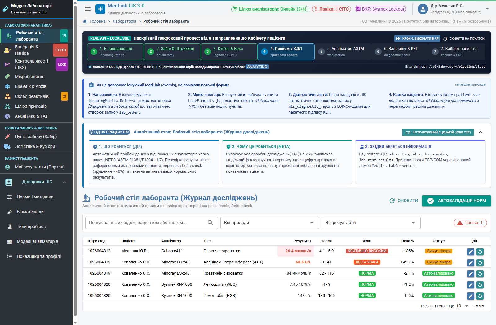
*Опис: 3-зонний модульний інтерфейс. Зліва фільтри та вибір аналізатора. По центру черга досліджень із кодуванням статусів. Справа деталі замовлення та швидке введення показників з автопідсвічуванням норм.*

### Скріншот 2: Внутрішній контроль якості (Леві-Дженнінгс та правила Вестгарда)
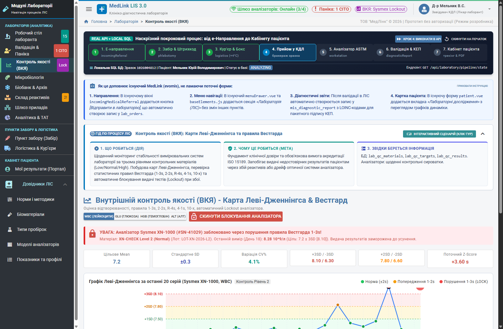
*Опис: Контрольні карти трьох рівнів біоматеріалу (Low, Normal, High), математичні показники X_mean, SD, CV%, автоматичний аудит правил Вестгарда (1(3s), 2(2s), R(4s), 10(x)).*

### Скріншот 3: Двоетапна валідація результатів та КЕП лікаря-лаборанта
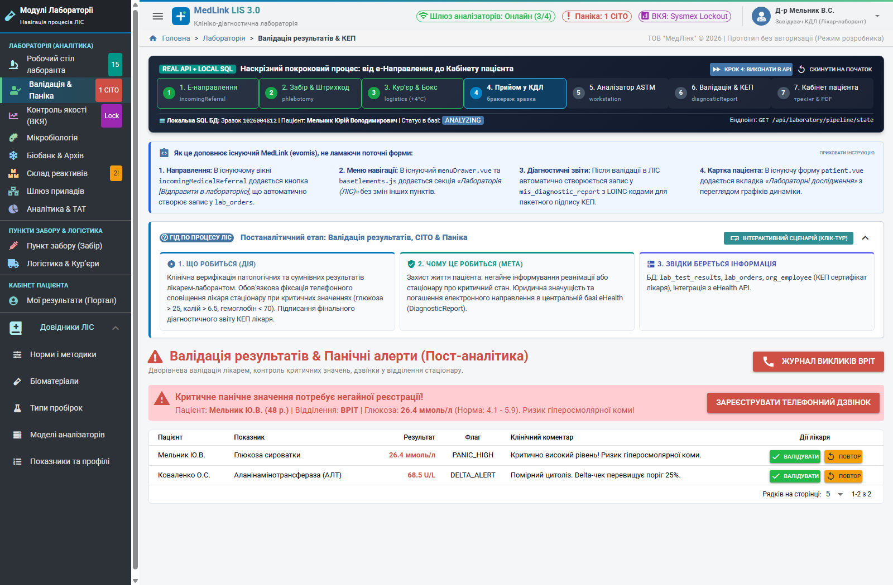
*Опис: Робоче місце верифікації результатів. Порівняння з референсними діапазонами, аналіз дельта-чеку (Delta%), пакетне затвердження та підпис кваліфікованим електронним підписом за ДСТУ 4145-2002.*

### Скріншот 4: Кабінет пацієнта — графіки динаміки та зелений коридор норми
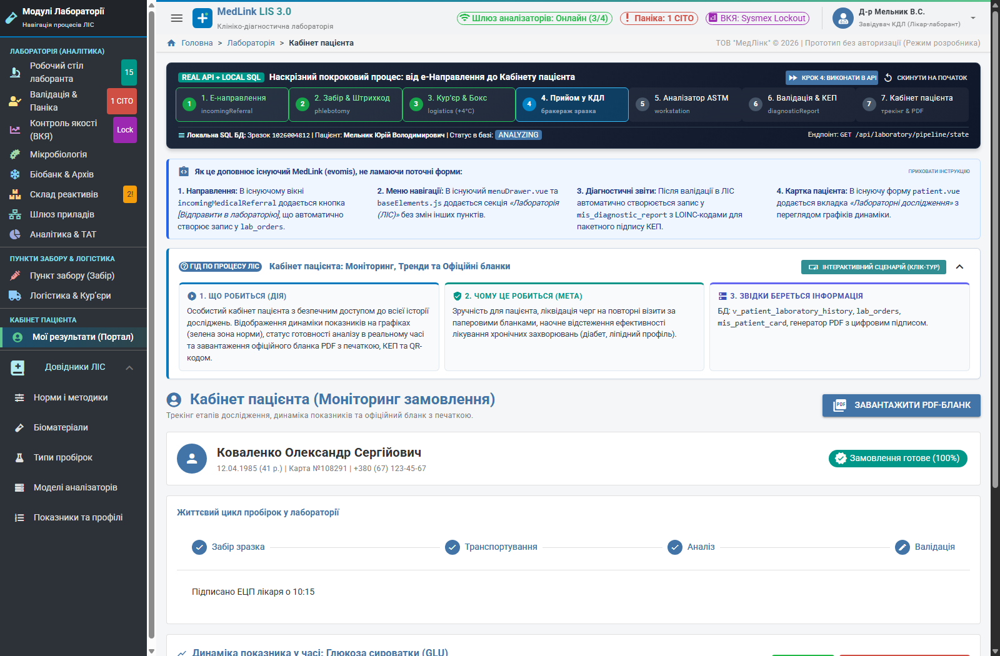
*Опис: Інтерактивний тренд лабораторних показників пацієнта за різні дати. Візуальний зелений коридор референтних значень, підсвічування точок патології, перемикач мобільного/веб вигляду.*

### Скріншот 5: Кріо-архів біоматеріалу (Біобанк 8х12 матриця, -80°C)
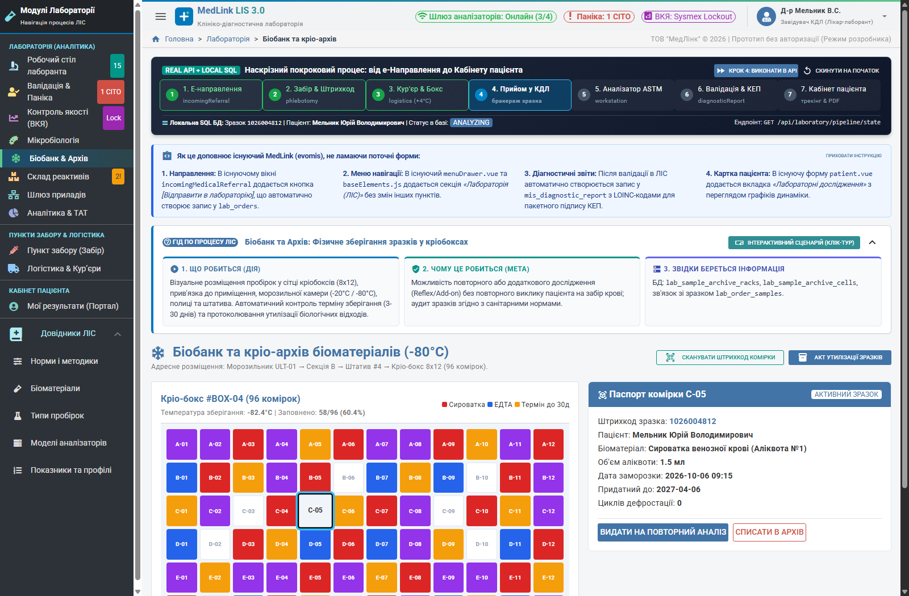
*Опис: Інтерактивна сітка кріобокса 96 лунок (A1..H12). Кольорова диференціація типу біоматеріалу (сироватка, плазма, ліквор), заповненості та термінів зберігання.*

### Скріншот 6: Бактеріологічний посів та антибіотикограма (EUCAST v14.0 2026)
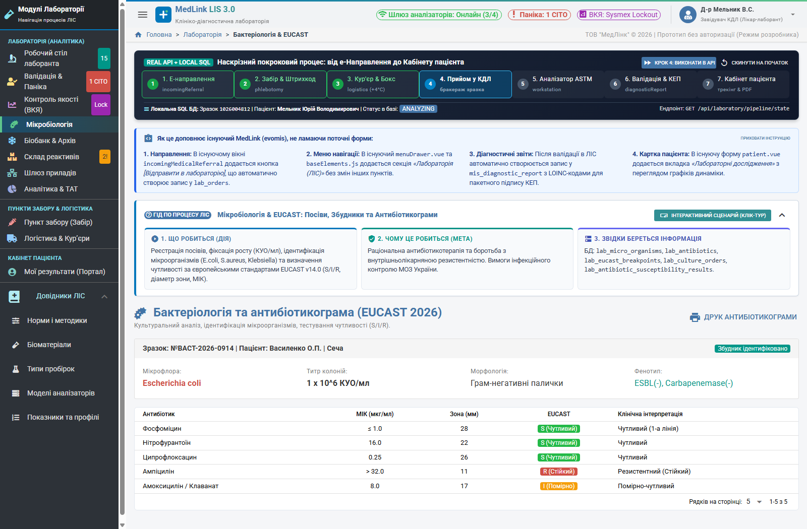
*Опис: Облік збудника (наприклад, Klebsiella pneumoniae), інтерактивні повзунки зон затримки росту антибіотиків (мм), автоматичне визначення чутливості S/I/R та прапорців стійкості ESBL.*

### Скріншот 7: Операційна аналітика продуктивності (TAT & Waterfall)
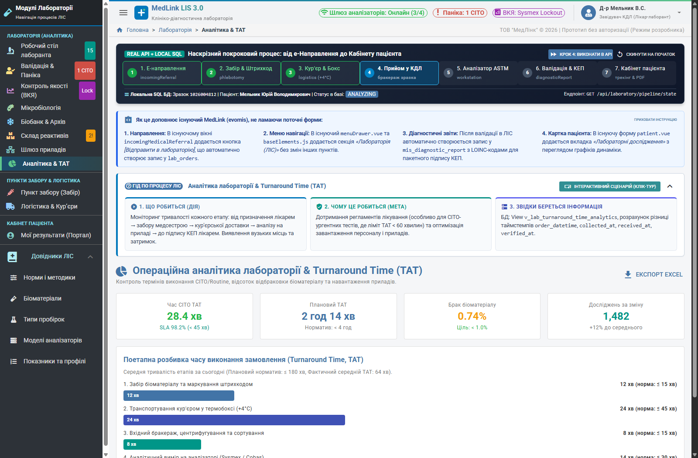
*Опис: Дашборд швидкості Turnaround Time. Waterfall-діаграма тривалості етапів «Забір - Доставка - Аналіз - Валідація», показники порушення SLA за відділеннями та змінами.*

### Скріншот 8: Логістика зразків та холодовий ланцюг (+4°C)
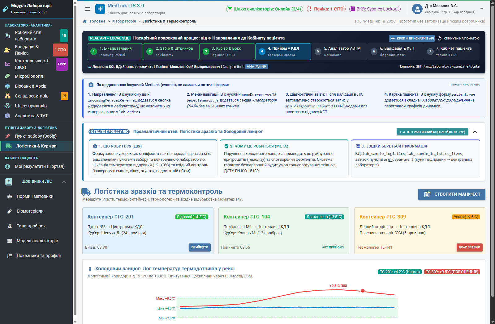
*Опис: Карта маршрутів кур'єрської доставки біоматеріалів із пунктів забору, моніторинг температури термоконтейнерів у реальному часі, фіксація порушень холодового ланцюга.*

### Скріншот 9: Термоетикетка пробірки зі штрихкодом Code128
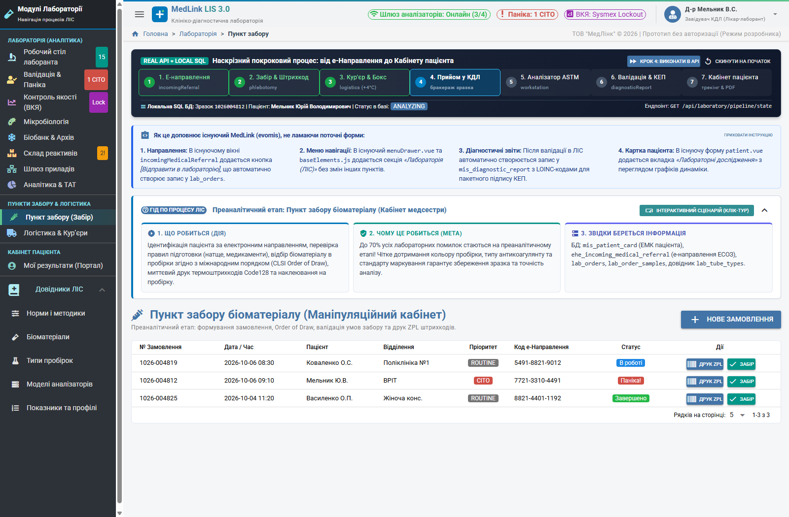
*Опис: Модальне вікно друку етикетки 40х25 мм для термопринтерів Zebra/Xprinter: штрихкод Code128, тип пробірки з кольоровою смугою кришки, ПІБ пацієнта, дата та час забору.*

### Скріншот 10: Офіційний лабораторний PDF-бланк із QR-верифікацією
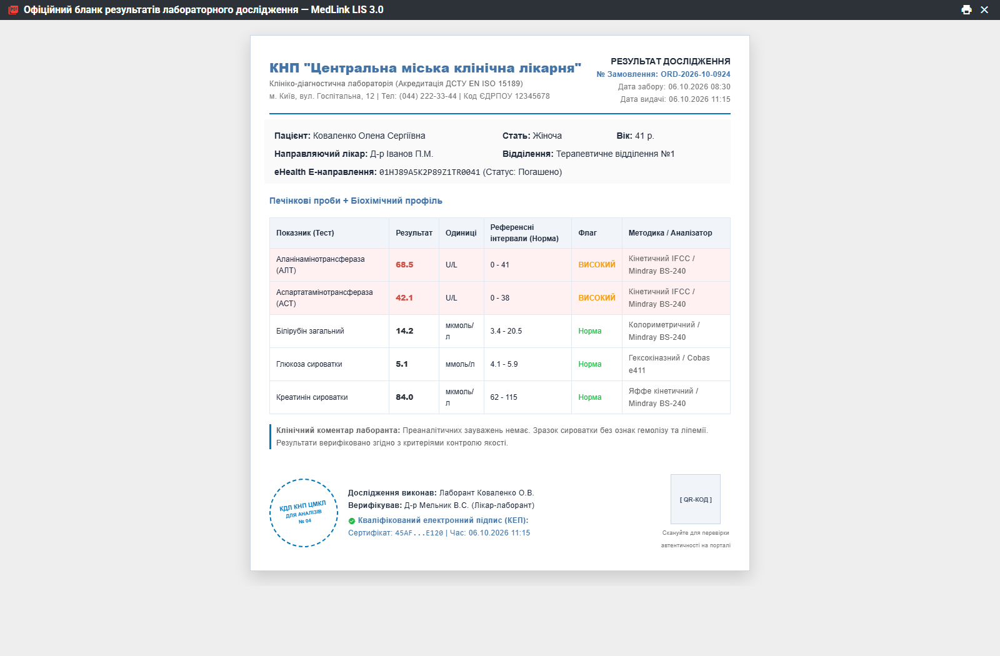
*Опис: Клінічний бланк формату А4 з логотипом, таблицею показників, виділенням патологій, цифровою печаткою лікаря та валідаційним QR-кодом для миттєвої перевірки автентичності.*

### Скріншот 11: Журнал критичних результатів CITO (Панічні дзвінки)

*Опис: Оперативний журнал сповіщення лікуючих лікарів про загрозу життю пацієнта (панічні значення калію, тропоніну, глюкози) із фіксацією часу та відповідального лікаря.*

### Скріншот 12: Протокол розблокування аналізатора після QC-інциденту (Lockout)
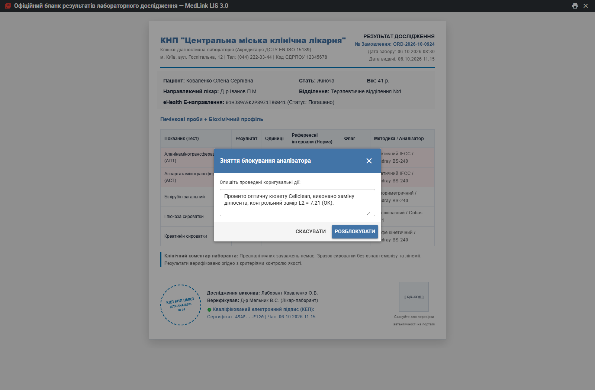
*Опис: Офіційний протокол зняття апаратного блокування аналізатора після спрацювання бракувального правила Вестгарда з обов'язковим зазначенням причини та коригувальних дій.*

### Скріншот 13: Каталог лабораторних послуг та матриця методик
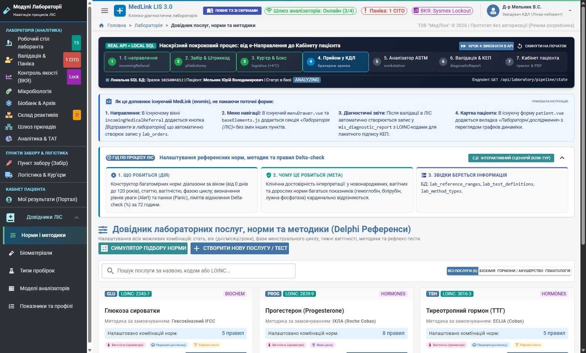
*Опис: Реєстр лабораторних досліджень із лічильниками методик, вікових комбінацій норм та налаштованих автоматичних reflex-правил.*

### Скріншот 14: Картка послуги та деталізація референтних комбінацій Delphi

*Опис: Детальний перегляд параметрів послуги: коди LOINC/НК 025:2021, біоматеріал, формули перерахунку та таблиця багатовимірних референтних інтервалів (вік, стать, вагітність).*

### Скріншот 15: Інтерактивний резолвер референтних норм (Playground)
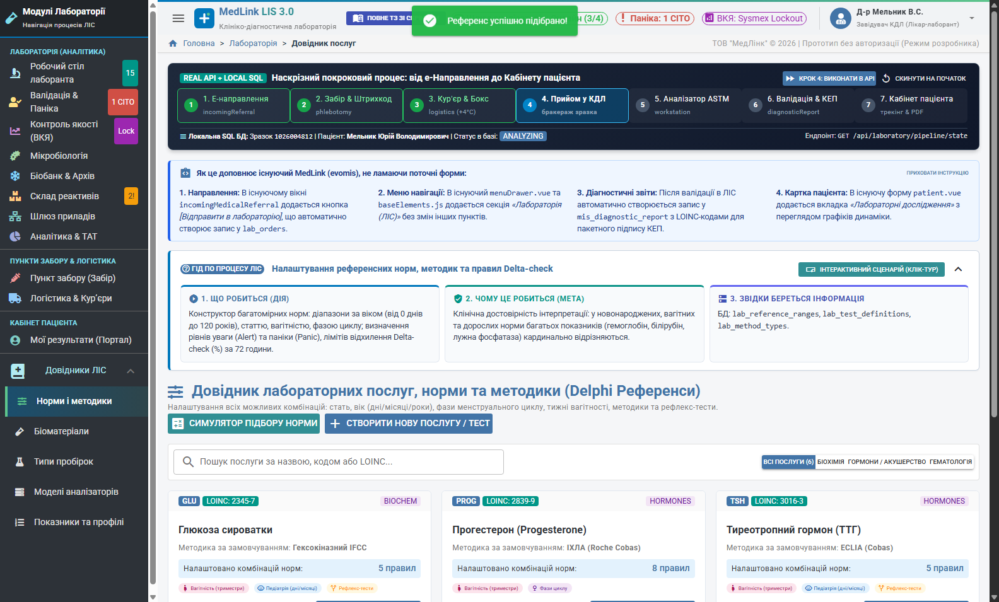
*Опис: Живий інженерний симулятор підбору референсного інтервалу в реальному часі за комбінацією параметрів: вік у роках/днях, стать, вагітність, фаза циклу, діагноз.*

---

## 12. Багатовимірна матриця референтів Delphi (Довідник послуг)

У системі MedLink ЛІС 3.0 повністю збережено та вдосконалено перевірену часом логіку довідника послуг із класичної Delphi-програми MedLink.

### 12.1. Архітектура референтних таблиць
- `dct_service_lab_norm`: Головний реєстр референтних наборів із прив'язкою до методики, аналізатора, біоматеріалу та одиниць виміру.
- `dct_service_lab_nv`: Таблиця конкретних нормативних інтервалів та текстових значень для кожної комбінації демографічних і клінічних факторів:
  - `GENDER`: Стать (Чоловіча, Жіноча, Універсальна).
  - `AGE_FROM` / `AGE_TO` та `AGE_UNIT`: Віковий інтервал у днях, місяцях або роках.
  - `PREGNANCY_TRIMESTER`: Триместр вагітності (1, 2, 3 або без вагітності).
  - `CYCLE_PHASE`: Фаза оваріального циклу (Фолікулярна, Овуляторна, Лютеїнова, Менопауза).
  - `NORM_MIN` / `NORM_MAX`: Числові межі норми.
  - `CRITICAL_LOW` / `CRITICAL_HIGH`: Панічні значення для виклику CITO.
  - `TEXT_NORM`: Текстова норма для якісних тестів («не виявлено», «негативний»).

### 12.2. Пріоритет підбору референсу (Резолвер)
1. Точний збіг: Послуга + Методика + Стать + Точний вік + Фаза/Триместр.
2. Стать + Вік (базова демографічна норма).
3. Загальна норма (All / Any).

---

## 13. Специфікація REST API (MedLink Laboratory Gateway)

| Метод | Ендпоінт | Призначення | Тіло запиту / Параметри | Тіло відповіді |
|---|---|---|---|---|
| `GET` | `/api/laboratory/pipeline/state` | Стан наскрізного процесу | — | JSON поточного етапу та лічильників |
| `POST` | `/api/laboratory/pipeline/advance` | Перехід на наступний етап | — | JSON оновленого стану |
| `POST` | `/api/laboratory/pipeline/reset` | Скидання процесу в початок | — | `{"success": true}` |
| `GET` | `/api/laboratory/worklist` | Отримання робочого списку | `status`, `cito`, `device_id` | Масив замовлень та досліджень |
| `POST` | `/api/laboratory/worklist/autoverify` | Запуск автоверифікації | `order_ids`: `[...]` | Кількість валідованих та відхилених |
| `POST` | `/api/laboratory/phlebotomy/collect` | Фіксація забору пробірки | `barcode`, `tube_type`, `nurse_id` | Статус готовності до передачі |
| `POST` | `/api/laboratory/qc/resolve-lockout` | Зняття Lockout аналізатора | `analyzer_id`, `cause`, `action` | `{"unlocked": true, "audit_id": ...}` |
| `GET` | `/api/laboratory/norms/combinations` | Отримання референтів послуги | `service_id`, `method_id` | Масив рядків норм Delphi |
| `POST` | `/api/laboratory/norms/combinations` | Збереження комбінації норми | Повний JSON об'єкта норми | Створений запис з ID |
| `POST` | `/api/laboratory/norms/resolve` | Резолвер норми для пацієнта | `service_id`, `gender`, `age_years` | Підібраний діапазон [min, max] |
| `GET` | `/api/laboratory/norms/reflex-rules` | Реєстр reflex-правил | `service_id` (опційно) | Список тригерів та цільових тестів |

---

## 14. DDL файли та схема бази даних (PostgreSQL / SQLite)

Усі структури даних підготовлені у вигляді чистих SQL скриптів у папці `C:\__MEDLINK___\LABA\sql\`:

1. `sql/00_master_deploy_all.sql` — Майстер-скрипт послідовного розгортання всієї бази.
2. `sql/01_lis_schema_core.sql` — Основні сутності ЛІС (`lis_orders`, `lis_tubes`, `lis_order_items`, `lis_worklists`, `lis_qc_runs`, `lis_biobank_cells`).
3. `sql/02_lis_schema_microbiology_eucast.sql` — Спеціалізовані таблиці бактеріології, збудників, антибіотиків та зон EUCAST.
4. `sql/03_evomis_integration_views_and_fk.sql` — Зв'язки із сутностями ядра МІС MedLink (`dct_service`, `contract_cards`, пацієнти, лікарі).
5. `sql/04_seed_biomaterials_and_tubes.sql` — Довідники біоматеріалів та кольорів кришок пробірок за ISO 6710.
6. `sql/05_seed_lab_methods_and_devices.sql` — Довідники методик та аналізаторів (Cobas, Sysmex, Mindray, Architect).
7. `sql/06_seed_services_and_tests.sql` — Базова номенклатура тестів з кодами LOINC та НК 025:2021.
8. `sql/07_seed_norms_and_reflex_rules.sql` — Референтні інтервали та правила рефлекс-тестування.
9. `sql/08_seed_microbiology_eucast.sql` — Довідник бактерій, антибіотиків та референтів зон затримки росту 2026 року.
10. `sql/09_seed_qc_controls_and_lots.sql` — Паспортні дані контрольних матеріалів трьох рівнів для карт Леві-Дженнінгса.

---

## 15. Апаратний шлюз .NET 8 (MedLink.LabConnector)

Для підключення лабораторних аналізаторів розроблено сервіс `MedLink.LabConnector`:
- **Стек:** .NET 8 Worker Service (кросплатформний: Windows Service / Linux systemd).
- **Підтримувані інтерфейси:** RS-232 / COM-порти (FTDI, USB-Serial), TCP/IP Client/Server.
- **Підтримувані протоколи:**
  - ASTM 1394-97 / ASTM 1238 (низькорівневе кодування з контрольними сумами ENQ/ACK/NAK/ETX).
  - HL7 v2.5.1 MLLP (Minimal Lower Layer Protocol) для сучасних високопродуктивних станцій.
- **Джерельний код:**
  - `MedLink.LabConnector/MedLink.LabConnector.csproj`
  - `MedLink.LabConnector/LabConnectorWorker.cs`
  - `MedLink.LabConnector/appsettings.json`

---

## 16. Реєстр файлів проєкту та навігація

Усі компоненти системи зібрано в єдиній папці `C:\__MEDLINK___\LABA\`:

```
C:\__MEDLINK___\LABA├── run_lab_server.bat                     # Швидкий запуск повного бекенду та прототипу
├── server_lab.py                          # Високопродуктивний REST API бекенд (порт 8088)
├── medlink_lab_local.db                   # Робоча локальна база даних SQLite
│
├── medlink_lab_frontend/                  # Фронтенд інтерфейси MedLink evomis
│   ├── run_prototype.html                 # Інтерактивний інтегрований прототип
│   ├── workstation.html                   # Робоче місце лаборанта
│   ├── qc_levey_jennings.html             # Контроль якості (Леві-Дженнінгс)
│   ├── validation.html                    # Верифікація результатів та КЕП
│   ├── patient_portal.html                # Кабінет пацієнта
│   ├── biobank.html                       # Кріо-архів 8х12 (-80°C)
│   ├── microbiology.html                  # Бактеріологія EUCAST v14.0
│   ├── analytics_tat.html                 # Дашборд TAT та Waterfall
│   ├── logistics.html                     # Логістика та холодовий ланцюг
│   └── norms_catalog.html                 # Каталог послуг, норми Delphi та Resolver
│
├── screenshots/                           # 15 живих знімків інтерфейсу (1600x1050)
│   ├── 01_workstation.png
│   ├── 02_qc_levey_jennings.png
│   ├── 03_validation_kep.png
│   ├── 04_patient_trend.png
│   ├── 05_biobank_8x12.png
│   ├── 06_microbiology_eucast.png
│   ├── 07_tat_analytics.png
│   ├── 08_logistics_coldchain.png
│   ├── 09_phlebotomy_barcode_modal.png
│   ├── 10_patient_pdf_modal.png
│   ├── 11_panic_cito_modal.png
│   ├── 12_qc_lockout_modal.png
│   ├── 13_norms_services_catalog.png
│   ├── 14_service_detail_modal_drilldown.png
│   └── 15_service_resolver_playground.png
│
├── sql/                                   # Повний пакет DDL та міграцій
│   ├── 00_master_deploy_all.sql
│   ├── 01_lis_schema_core.sql
│   ├── 02_lis_schema_microbiology_eucast.sql
│   ├── 03_evomis_integration_views_and_fk.sql
│   └── 04..09_seed_*.sql
│
├── MedLink.LabConnector/                  # Апаратний шлюз .NET 8 (ASTM/HL7)
│   ├── MedLink.LabConnector.csproj
│   ├── LabConnectorWorker.cs
│   └── appsettings.json
│
├── ТЗ_ЛІС_MedLink_v3_Master_Specification.html   # Майстер-ТЗ у веб-форматі
├── TZ_LIS_MedLink_v3_Master_Specification.html   # Веб-ТЗ (ASCII-безпечне ім'я)
├── ТЗ_ЛІС_MedLink_v3_Master_Specification.md     # Майстер-ТЗ у Markdown
└── TZ_LIS_MedLink_v3_Master_Specification.md     # Markdown-ТЗ (ASCII-безпечне ім'я)
```

---

**Розробник та інтегратор:** ТОВ «МедЛінк» (MedLink LLC) © 2026. Усі права захищено.
